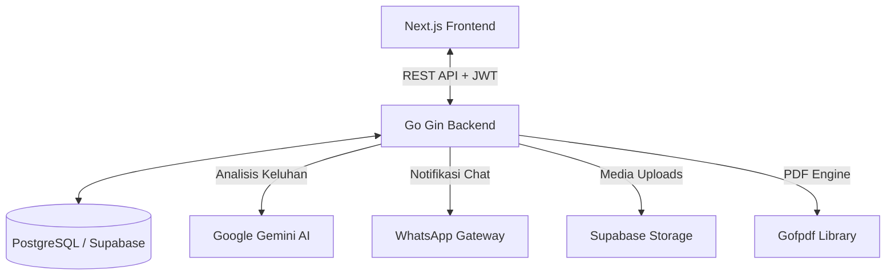

# Lapor Kos 🏢

**Lapor Kos** adalah platform aplikasi manajemen kos-kosan terintegrasi yang dirancang untuk mempermudah operasional pemilik kos (owner) sekaligus meningkatkan kenyamanan bagi penghuni (tenant). Aplikasi ini mengotomatiskan siklus tagihan bulanan, pencatatan pembayaran, manajemen kontrak, pelaporan keluhan fasilitas berbasis AI, hingga pembuatan dokumen laporan keuangan dalam format PDF secara instan.

---

## 🎯 Tujuan Aplikasi
Tujuan utama dari **Lapor Kos** adalah menghilangkan kompleksitas administrasi manual pada pengelolaan kos-kosan dengan cara:
* **Digitalisasi Administrasi**: Mengganti pembukuan kertas atau spreadsheet manual dengan basis data yang terorganisir.
* **Otomatisasi Tagihan**: Mengurangi keterlambatan pembayaran dengan sistem kalkulasi tagihan bulanan otomatis.
* **Transparansi Komunikasi**: Menyediakan portal pengajuan keluhan fasilitas bagi penghuni yang terpantau langsung oleh pemilik.
* **Analisis Finansial Cepat**: Menyajikan visualisasi arus kas bulanan secara langsung untuk mendukung pengambilan keputusan.

---

## 🚀 Fitur Utama & Penjelasan

### 1. Manajemen Kamar & Penghuni (Room Visualizer)
* **Keterangan**: Pemilik dapat memantau status hunian setiap kamar (kosong vs terisi) di setiap lantai secara visual. Sistem mendukung draf pendaftaran kamar baru, pembagian tipe kamar, dan alokasi penghuni baru.
* **Kelebihan**: Tampilan berbasis grid yang interaktif memberikan gambaran okupansi kos secara cepat dalam sekali pandang.

### 2. Otomatisasi Tagihan Bulanan (Billing Engine)
* **Keterangan**: Setiap bulan, sistem secara otomatis menghitung tagihan sewa bulanan beserta biaya tambahan (listrik, air, dan biaya lainnya).
* **Kelebihan**: Fleksibilitas tinggi di mana pemilik dapat mengubah rincian tagihan secara manual untuk setiap penghuni sebelum diverifikasi.

### 3. Pelacakan Pembayaran Multi-Metode (Payment Tracking)
* **Keterangan**: Portal khusus penghuni untuk mengunggah bukti pembayaran, memilih metode pembayaran (transfer bank, e-wallet, tunai), serta melihat riwayat kwitansi digital. Pemilik memiliki panel khusus untuk memverifikasi pembayaran (Lunas, Sebagian, Terlambat).
* **Kelebihan**: Transparansi data yang tinggi. Kwitansi digital terintegrasi dapat dicetak langsung oleh penghuni maupun pemilik.

### 4. Kalender Kontrak & Pengingat Jatuh Tempo
* **Keterangan**: Menyediakan kalender interaktif yang memetakan tanggal berakhirnya kontrak setiap penghuni dengan indikator warna dinamis. Mendukung perpanjangan kontrak instan (*extend*) maupun proses *checkout* penghuni.
* **Kelebihan**: Mencegah kehilangan potensi pendapatan karena keterlambatan perpanjangan kontrak.

### 5. Komplain & Pelaporan Fasilitas Berbasis AI (Gemini Integration)
* **Keterangan**: Penghuni dapat melaporkan kerusakan fasilitas kos dengan mengunggah foto keluhan. Sistem backend memanfaatkan **Google Gemini API** untuk menganalisis deskripsi keluhan, mengkategorikannya secara otomatis, serta menentukan prioritas perbaikan (Low, Medium, High).
* **Kelebihan**: Pemilik kos dapat memprioritaskan perbaikan kerusakan yang kritis secara objektif berdasarkan rekomendasi AI.

### 6. Integrasi Notifikasi WhatsApp Gateway (Fonnte)
* **Keterangan**: Mengirimkan notifikasi langsung ke nomor WhatsApp penghuni saat tagihan baru dibuat, atau saat komplain mereka telah diperbarui statusnya oleh pemilik.
* **Kelebihan**: Menjangkau pengguna langsung pada aplikasi chat yang paling sering mereka gunakan tanpa perlu membuka aplikasi web terus-menerus.

### 7. Dashboard & Laporan Keuangan PDF Instan
* **Keterangan**: Menyajikan grafik tren pendapatan bulanan, rasio keberhasilan penagihan (*collection rate*), serta tabel transaksi detail. Dilengkapi fitur pratinjau (*preview*) interaktif dan unduhan laporan PDF formal.
* **Kelebihan**: Menggunakan mesin pembuat PDF open-source yang ringan tanpa lisensi berbayar, memastikan laporan siap cetak secara instan kapan saja.

---

## 🛠️ Tech Stack & Persyaratan Sistem

### Arsitektur Sistem
Aplikasi ini dibangun menggunakan arsitektur monolitik terpisah (Decoupled Frontend & Backend):



### Versi Minimum Perangkat Lunak
* **Golang runtime**: `v1.25.x` atau lebih baru.
* **Node.js**: `v22.x` (LTS) atau lebih baru.
* **PostgreSQL Database**: `v15.x` atau lebih baru (Sangat direkomendasikan menggunakan Supabase).

---

## 🚀 Panduan Memulai Cepat

Proyek ini terbagi menjadi dua direktori utama:
1. `/backend` - Logika API server, cron job tagihan bulanan, notifikasi, dan integrasi AI.
2. `/frontend` - Antarmuka pengguna (Dashboard, Grafik Keuangan, Portal Penghuni).


---

## Menjalankan Project dengan Docker

Project ini sudah mendukung Docker untuk menjalankan dua service utama:

1. `backend` - API server Go/Gin pada port `8081`.
2. `frontend` - aplikasi Next.js pada port `3000`.

Docker membuat environment aplikasi lebih konsisten karena Go, Node.js, dependency, dan command production sudah dibungkus dalam image masing-masing.

### File Docker yang Digunakan

* `backend/Dockerfile` - resep untuk membuat image backend Go.
* `backend/.dockerignore` - mencegah file lokal seperti `.env` dan file `.exe` ikut masuk ke proses build backend.
* `frontend/Dockerfile` - resep untuk membuat image frontend Next.js.
* `frontend/.dockerignore` - mencegah `node_modules`, `.next`, dan `.env.local` ikut masuk ke proses build frontend.
* `docker-compose.yml` - konfigurasi untuk menjalankan container backend dan frontend secara bersamaan.
* `.env.docker.example` - contoh konfigurasi Docker Compose yang aman untuk disimpan di Git.

### Persiapan Environment

Pastikan file environment lokal berikut sudah tersedia:

```bash
backend/.env
frontend/.env.local
```

File `backend/.env` berisi konfigurasi sensitif seperti `DATABASE_URL`, `JWT_SECRET`, `GEMINI_API_KEY`, token WhatsApp, dan Supabase service key. File ini tidak boleh di-push ke GitHub.

Contoh konfigurasi Docker Compose dapat dilihat di:

```bash
.env.docker.example
```

Jika ingin mengubah nilai default Docker Compose, salin file tersebut menjadi `.env` di root project:

```bash
cp .env.docker.example .env
```

Untuk Windows PowerShell:

```powershell
Copy-Item .env.docker.example .env
```

### Menjalankan Container

Jalankan dari root project:

```bash
docker compose up --build -d
```

Perintah tersebut akan:

1. Membuat image backend dari `backend/Dockerfile`.
2. Membuat image frontend dari `frontend/Dockerfile`.
3. Membuat container `lapor-kos-backend`.
4. Membuat container `lapor-kos-frontend`.
5. Menjalankan keduanya di background.

Setelah berhasil, akses aplikasi melalui:

```bash
Frontend: http://localhost:3000
Backend:  http://localhost:8081/api/health
```

### Command Docker yang Sering Dipakai

Cek status container:

```bash
docker compose ps
```

Melihat log semua service:

```bash
docker compose logs -f
```

Melihat log backend saja:

```bash
docker compose logs -f backend
```

Melihat log frontend saja:

```bash
docker compose logs -f frontend
```

Restart container:

```bash
docker compose restart
```

Mematikan dan menghapus container:

```bash
docker compose down
```

Build ulang image setelah ada perubahan Dockerfile atau dependency:

```bash
docker compose up --build -d
```

### Catatan Keamanan GitHub

Aman untuk mengirim file berikut ke GitHub:

```bash
backend/Dockerfile
backend/.dockerignore
frontend/Dockerfile
frontend/.dockerignore
docker-compose.yml
.env.docker.example
backend/.env.example
frontend/.env.example
```

Tidak aman untuk mengirim file berikut ke GitHub:

```bash
backend/.env
frontend/.env.local
.env
```

Alasannya, file tersebut biasanya berisi password database, JWT secret, API key Gemini, token WhatsApp, SMTP password, dan Supabase service role key. Jika terlanjur ter-push ke GitHub, anggap secret tersebut sudah bocor dan segera rotasi/ganti semua key terkait.

Solusi yang direkomendasikan:

1. Simpan secret hanya di file lokal `.env` yang sudah masuk `.gitignore`.
2. Commit hanya file contoh seperti `.env.example` atau `.env.docker.example`.
3. Untuk deployment production, simpan secret di environment server, Docker secrets, GitHub Actions Secrets, atau Jenkins Credentials.
4. Jalankan `git status --short` sebelum commit untuk memastikan file `.env` asli tidak ikut masuk.
5. Hindari membagikan output `docker compose config` karena command tersebut dapat menampilkan isi environment variable.

### Referensi Manual

=======

Silakan merujuk ke panduan masing-masing folder untuk petunjuk instalasi dan penyiapan detail:
* 📄 **[Panduan Backend (Go)](file:///d:/project_yosua/lapor-kos/backend/README.md)**
* 📄 **[Panduan Frontend (Next.js)](file:///d:/project_yosua/lapor-kos/frontend/README.md)**
