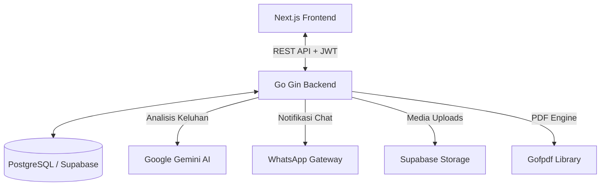

# Lapor Kos 🏢

**Lapor Kos** adalah platform aplikasi manajemen kos-kosan terintegrasi yang dirancang untuk mempermudah operasional pemilik kos (owner) sekaligus meningkatkan kenyamanan bagi penghuni (tenant). Aplikasi ini mengotomatiskan siklus tagihan bulanan, pencatatan pembayaran, manajemen kontrak, pelaporan keluhan fasilitas berbasis AI, hingga pembuatan dokumen laporan keuangan dalam format PDF secara instan.

---

## 🎯 Tujuan Aplikasi
Tujuan utama dari **Lapor Kos** adalah menghilangkan kompleksitas administrasi manual pada pengelolaan kos-kosan dengan cara:
* **Digitalisasi Administrasi**: Mengganti pembukuan kertas atau spreadsheet manual dengan basis data yang terorganisir.
* **Otomatisasi Tagihan**: Mengurangi keterlambatan pembayaran dengan sistem kalkulasi tagihan bulanan otomatis.
* **Transparansi Komunikasi**: Menyediakan portal pengajuan keluhan fasilitas bagi penghuni yang terpantau langsung oleh pemilik.
* **Analisis Finansial Cepat**: Menyajikan visualisasi arus kas bulanan secara langsung untuk mendukung pengambilan keputusan.

---

## 🚀 Fitur Utama & Penjelasan

### 1. Manajemen Kamar & Penghuni (Room Visualizer)
* **Keterangan**: Pemilik dapat memantau status hunian setiap kamar (kosong vs terisi) di setiap lantai secara visual. Sistem mendukung draf pendaftaran kamar baru, pembagian tipe kamar, dan alokasi penghuni baru.
* **Kelebihan**: Tampilan berbasis grid yang interaktif memberikan gambaran okupansi kos secara cepat dalam sekali pandang.

### 2. Otomatisasi Tagihan Bulanan (Billing Engine)
* **Keterangan**: Setiap bulan, sistem secara otomatis menghitung tagihan sewa bulanan beserta biaya tambahan (listrik, air, dan biaya lainnya).
* **Kelebihan**: Fleksibilitas tinggi di mana pemilik dapat mengubah rincian tagihan secara manual untuk setiap penghuni sebelum diverifikasi.

### 3. Pelacakan Pembayaran Multi-Metode (Payment Tracking)
* **Keterangan**: Portal khusus penghuni untuk mengunggah bukti pembayaran, memilih metode pembayaran (transfer bank, e-wallet, tunai), serta melihat riwayat kwitansi digital. Pemilik memiliki panel khusus untuk memverifikasi pembayaran (Lunas, Sebagian, Terlambat).
* **Kelebihan**: Transparansi data yang tinggi. Kwitansi digital terintegrasi dapat dicetak langsung oleh penghuni maupun pemilik.

### 4. Kalender Kontrak & Pengingat Jatuh Tempo
* **Keterangan**: Menyediakan kalender interaktif yang memetakan tanggal berakhirnya kontrak setiap penghuni dengan indikator warna dinamis. Mendukung perpanjangan kontrak instan (*extend*) maupun proses *checkout* penghuni.
* **Kelebihan**: Mencegah kehilangan potensi pendapatan karena keterlambatan perpanjangan kontrak.

### 5. Komplain & Pelaporan Fasilitas Berbasis AI (Gemini Integration)
* **Keterangan**: Penghuni dapat melaporkan kerusakan fasilitas kos dengan mengunggah foto keluhan. Sistem backend memanfaatkan **Google Gemini API** untuk menganalisis deskripsi keluhan, mengkategorikannya secara otomatis, serta menentukan prioritas perbaikan (Low, Medium, High).
* **Kelebihan**: Pemilik kos dapat memprioritaskan perbaikan kerusakan yang kritis secara objektif berdasarkan rekomendasi AI.

### 6. Integrasi Notifikasi WhatsApp Gateway (Fonnte)
* **Keterangan**: Mengirimkan notifikasi langsung ke nomor WhatsApp penghuni saat tagihan baru dibuat, atau saat komplain mereka telah diperbarui statusnya oleh pemilik.
* **Kelebihan**: Menjangkau pengguna langsung pada aplikasi chat yang paling sering mereka gunakan tanpa perlu membuka aplikasi web terus-menerus.

### 7. Dashboard & Laporan Keuangan PDF Instan
* **Keterangan**: Menyajikan grafik tren pendapatan bulanan, rasio keberhasilan penagihan (*collection rate*), serta tabel transaksi detail. Dilengkapi fitur pratinjau (*preview*) interaktif dan unduhan laporan PDF formal.
* **Kelebihan**: Menggunakan mesin pembuat PDF open-source yang ringan tanpa lisensi berbayar, memastikan laporan siap cetak secara instan kapan saja.

---

## 🛠️ Tech Stack & Persyaratan Sistem

### Arsitektur Sistem
Aplikasi ini dibangun menggunakan arsitektur monolitik terpisah (Decoupled Frontend & Backend):

### Versi Minimum Perangkat Lunak
* **Golang runtime**: `v1.25.x` atau lebih baru.
* **Node.js**: `v22.x` (LTS) atau lebih baru.
* **PostgreSQL Database**: `v15.x` atau lebih baru (Sangat direkomendasikan menggunakan Supabase).

---

## 🚀 Panduan Memulai Cepat

Proyek ini terbagi menjadi dua direktori utama:
1. `/backend` - Logika API server, cron job tagihan bulanan, notifikasi, dan integrasi AI.
2. `/frontend` - Antarmuka pengguna (Dashboard, Grafik Keuangan, Portal Penghuni).

Silakan merujuk ke panduan masing-masing folder untuk petunjuk instalasi dan penyiapan detail:
* 📄 **[Panduan Backend (Go)](file:///d:/project_yosua/lapor-kos/backend/README.md)**
* 📄 **[Panduan Frontend (Next.js)](file:///d:/project_yosua/lapor-kos/frontend/README.md)**
