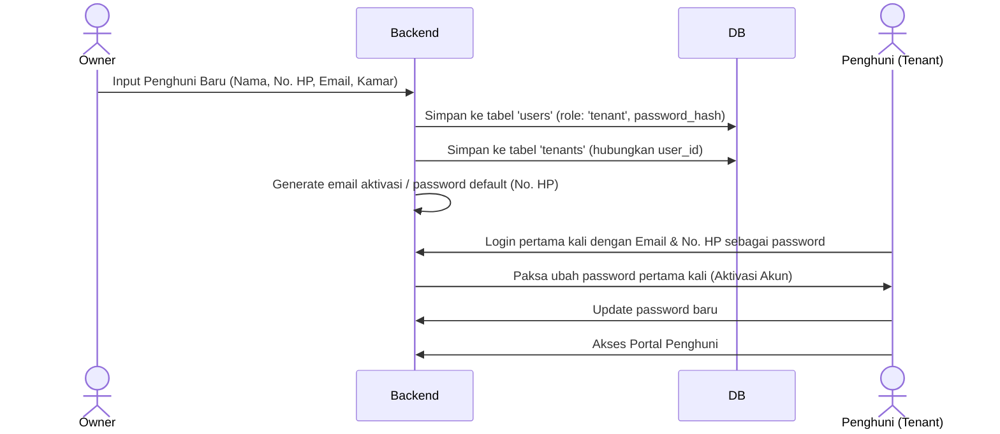

# Rencana Implementasi: Pelacakan Pembayaran Multi-metode & Portal Penghuni (Issue #6)

Dokumen ini merupakan panduan teknis mendalam yang dirancang agar mudah dipahami oleh **programmer junior** atau model **LLM yang lebih murah**. Rencana ini mencakup modifikasi database, pembuatan API backend (Go), pengembangan UI/UX frontend (Next.js) dengan peran pengguna baru (Penghuni), serta mekanisme pengujian.

---

## 1. Keputusan Desain & Alur Autentikasi Penghuni

### **Pertanyaan Desain:**
> *Apakah sebaiknya pemilik kos (Owner) yang membuatkan akun penghuni, atau penghuni yang mendaftar sendiri?*

### **Keputusan Teknis: Auto-Provisioning Akun oleh Owner (Direkomendasikan)**
Sistem akan menggunakan pendekatan **Owner-created / Auto-provisioned Account** dengan pertimbangan berikut:
1. **Keamanan & Validasi**: Kamar kos adalah properti privat. Hanya penghuni dengan kontrak sah yang boleh memiliki akses. Registrasi mandiri (self-registration) berisiko menyebarkan akun liar yang tidak terikat ke kamar mana pun.
2. **Konsistensi Data**: Ketika Owner mendaftarkan penghuni baru (mengisi nama, nomor telepon, dan email), sistem secara otomatis membuat akun di tabel `users` dengan `role = 'tenant'` dan menghubungkannya dengan data `tenants`. Hal ini mencegah ketidakcocokan data.
3. **UX yang Mulus**: Penghuni tidak perlu mendaftar dan menunggu persetujuan. Mereka langsung login menggunakan email mereka dengan password default (misalnya nomor telepon mereka atau kode sandi sementara) dan langsung melihat informasi kamar serta tagihannya.

### **Alur Kerja Pembuatan Akun:**


---

## 2. Rencana Perubahan Database (Database Migration)

Buat file migrasi baru: [007_add_tenant_user_and_payments.sql](file:///d:/project_yosua/lapor-kos/backend/migrations/007_add_tenant_user_and_payments.sql).

### **Detail Perubahan Schema:**
1. **Tabel `tenants`**: Tambahkan kolom `user_id` yang mereferensikan tabel `users(id)` untuk menghubungkan data profil penghuni dengan data autentikasinya.
2. **Tabel `payments`**: Tabel baru untuk menyimpan histori pembayaran sewa dan utilitas (listrik, air, biaya lainnya).

```sql
-- migrations/007_add_tenant_user_and_payments.sql

-- 1. Hubungkan tabel tenants ke tabel users
ALTER TABLE tenants ADD COLUMN user_id UUID REFERENCES users(id) ON DELETE SET NULL;

-- 2. Buat tabel payments untuk mencatat tagihan dan pembayaran
CREATE TABLE payments (
  id UUID PRIMARY KEY DEFAULT gen_random_uuid(),
  contract_id UUID REFERENCES contracts(id) ON DELETE CASCADE,
  owner_id UUID REFERENCES users(id) ON DELETE SET NULL,
  period_month INT NOT NULL,
  period_year INT NOT NULL,
  amount_rent NUMERIC(12,2) DEFAULT 0,
  amount_electricity NUMERIC(12,2) DEFAULT 0,
  amount_water NUMERIC(12,2) DEFAULT 0,
  amount_other NUMERIC(12,2) DEFAULT 0,
  total_paid NUMERIC(12,2) DEFAULT 0,
  payment_method VARCHAR(30), -- 'cash', 'transfer', 'ovo', 'gopay', 'qris'
  status VARCHAR(20) DEFAULT 'unpaid', -- 'unpaid', 'pending', 'paid', 'partial', 'overdue'
  proof_photo_url TEXT,
  paid_at TIMESTAMPTZ,
  due_date DATE NOT NULL,
  notes TEXT,
  created_at TIMESTAMPTZ DEFAULT NOW()
);

-- Index untuk mempercepat query pencarian tagihan
CREATE INDEX idx_payments_contract ON payments(contract_id);
CREATE INDEX idx_payments_status ON payments(status);
```

---

## 3. Implementasi Backend (Go & pgxpool)

### **3.1 Model Baru (Go Structs)**
Buat file baru [payment.go](file:///d:/project_yosua/lapor-kos/backend/internal/model/payment.go):
```go
package model

import (
	"time"
	"github.com/google/uuid"
)

type Payment struct {
	ID                uuid.UUID  `json:"id" db:"id"`
	ContractID        uuid.UUID  `json:"contract_id" db:"contract_id"`
	OwnerID           *uuid.UUID `json:"owner_id,omitempty" db:"owner_id"`
	PeriodMonth       int        `json:"period_month" db:"period_month"`
	PeriodYear        int        `json:"period_year" db:"period_year"`
	AmountRent        float64    `json:"amount_rent" db:"amount_rent"`
	AmountElectricity float64    `json:"amount_electricity" db:"amount_electricity"`
	AmountWater       float64    `json:"amount_water" db:"amount_water"`
	AmountOther       float64    `json:"amount_other" db:"amount_other"`
	TotalPaid         float64    `json:"total_paid" db:"total_paid"`
	PaymentMethod     string     `json:"payment_method" db:"payment_method"`
	Status            string     `json:"status" db:"status"` // unpaid, pending, paid, partial, overdue
	ProofPhotoURL     string     `json:"proof_photo_url" db:"proof_photo_url"`
	PaidAt            *time.Time `json:"paid_at" db:"paid_at"`
	DueDate           time.Time  `json:"due_date" db:"due_date"`
	Notes             string     `json:"notes" db:"notes"`
	CreatedAt         time.Time  `json:"created_at" db:"created_at"`
	
	// Preloaded data
	Contract *Contract `json:"contract,omitempty"`
}

type SubmitPaymentRequest struct {
	PaymentMethod string  `form:"payment_method" binding:"required"`
	TotalPaid     float64 `form:"total_paid" binding:"required"`
	Notes         string  `form:"notes"`
}

type VerifyPaymentRequest struct {
	AmountRent        float64 `json:"amount_rent"`
	AmountElectricity float64 `json:"amount_electricity"`
	AmountWater       float64 `json:"amount_water"`
	AmountOther       float64 `json:"amount_other"`
	TotalPaid         float64 `json:"total_paid" binding:"required"`
	Status            string  `json:"status" binding:"required"` // paid, partial, unpaid
	Notes             string  `json:"notes"`
}
```

### **3.2 API Route Mapping di [main.go](file:///d:/project_yosua/lapor-kos/backend/main.go)**
Daftarkan endpoints baru dengan skema perlindungan Role-Based Access Control (RBAC):

```go
// Di dalam main.go
payments := api.Group("/payments", middleware.AuthMiddleware())
{
    // Akses Bersama (Owner & Tenant)
    payments.GET("/:id", paymentHandler.GetPayment)
    payments.GET("/:id/receipt", paymentHandler.GetReceiptHTML)

    // Akses Khusus Owner
    payments.GET("", middleware.RoleMiddleware("owner"), paymentHandler.GetAllPayments)
    payments.POST("", middleware.RoleMiddleware("owner"), paymentHandler.CreatePaymentBill) // Generate tagihan manual
    payments.PUT("/:id/verify", middleware.RoleMiddleware("owner"), paymentHandler.VerifyPayment) // Verifikasi bukti transfer

    // Akses Khusus Tenant (Penghuni)
    payments.GET("/my", middleware.RoleMiddleware("tenant"), paymentHandler.GetTenantPayments)
    payments.POST("/:id/submit", middleware.RoleMiddleware("tenant"), paymentHandler.SubmitPaymentProof) // Upload bukti transfer
}
```

### **3.3 Middleware Tambahan (`RoleMiddleware`)**
Buat middleware baru di `backend/internal/middleware/role.go` untuk memeriksa kolom `role` di data user:
```go
package middleware

import (
	"net/http"
	"github.com/gin-gonic/gin"
)

// RoleMiddleware membatasi endpoint berdasarkan role user ('owner' atau 'tenant')
func RoleMiddleware(allowedRoles ...string) gin.HandlerFunc {
	return func(c *gin.Context) {
		// Dapatkan data user dari context (pastikan dipanggil SETELAH AuthMiddleware)
		// Kita perlu mengambil info user dari database berdasarkan user_id di JWT claims
		// Atau menyimpannya di context saat AuthMiddleware berjalan.
		
		// IMPLEMENTASI JUNIOR: 
		// Ambil role dari tabel users berdasarkan context 'user_id'
		// Jika role tidak termasuk dalam allowedRoles, return 403 Forbidden
	}
}
```

### **3.4 Otomatisasi Pembuatan Akun saat Owner Membuat Data Penghuni**
Pada file [tenant_repository.go](file:///d:/project_yosua/lapor-kos/backend/internal/repository/tenant_repository.go), modifikasi fungsi `Create`:
1. Jika parameter data `tenant` mengandung nomor telepon / email, sistem secara otomatis memasukkan record baru di tabel `users`.
2. Password di-hash menggunakan `bcrypt` dengan default password berupa nomor handphone penghuni.
3. Hubungkan ID user baru ke kolom `user_id` di tabel `tenants`.
```go
// Detail perubahan repositori:
// Di dalam query INSERT tenants, tambahkan kolom user_id.
// Pastikan transaksi database (tx) berjalan atomik agar jika pembuatan user gagal, pembuatan tenant juga di-rollback.
```

---

## 4. Implementasi Frontend (Next.js & Tailwind CSS 4)

Tampilan frontend harus dibuat **sangat ramah pengguna (user-friendly)** untuk penghuni, mengingat sebagian besar akses dilakukan melalui **Smartphone**. Desain menggunakan gaya modern yang responsif, mengadopsi Glassmorphism, harmoni warna HSL dari `globals.css` (Teal untuk status lunas/aktif, Navy untuk latar utama, Amber untuk status tertunda).

### **4.1 Perubahan Sidebar Navigasi Dinamis di Layout**
Modifikasi [layout.tsx](file:///d:/project_yosua/lapor-kos/frontend/src/app/%28dashboard%29/layout.tsx) agar merender menu navigasi berdasarkan peran pengguna (`role`):

```typescript
// Di dalam layout.tsx:
const getNavItems = (role: string) => {
  if (role === 'tenant') {
    return [
      { section: 'MENU PENGHUNI', items: [
        { name: 'Dashboard Saya', href: '/', icon: LayoutDashboard },
        { name: 'Tagihan & Pembayaran', href: '/payments', icon: CreditCard },
      ]},
      { section: 'DURASI SEWA', items: [
        { name: 'Komplain Fasilitas', href: '/complaints', icon: MessageSquare },
        { name: 'Pengaturan Akun', href: '/settings', icon: Settings },
      ]}
    ];
  }
  
  // Default menu Owner (seperti kode yang sudah ada)
  return [
    { section: 'MENU UTAMA', items: [...] },
    { section: 'KEUANGAN', items: [...] },
    { section: 'LAINNYA', items: [...] }
  ];
};
```

---

### **4.2 Tampilan Dashboard Utama Penghuni (`/` jika Role = 'tenant')**
Jika pengguna masuk sebagai penghuni, gantikan halaman ringkasan owner menjadi ringkasan personal penghuni dengan layout minimalis dan modern:

#### **Komponen-komponen visual utama:**
1. **Widget Status Kontrak & Kamar (Glassmorphism Card)**
   - Menampilkan nomor kamar (misal: "Kamar 102") dengan ukuran teks besar.
   - Sisa hari sewa dihitung mundur (misal: "12 hari tersisa" dengan bar kemajuan/progress bar yang berubah warna menjadi merah jika < 5 hari).
2. **Kantung Tagihan Aktif (Bill Widget)**
   - Jika ada tagihan belum lunas, tampilkan card berbayang lembut dengan warna dasar Amber/Kuning (Status `unpaid` atau `overdue`).
   - Tampilkan rincian: Sewa bulanan + utilitas (Listrik & Air jika ada).
   - Tombol **"Bayar Sekarang"** untuk membuka modal unggah bukti transfer.
3. **Menu Pembayaran Cepat (Quick Payment)**
   - Menampilkan nomor rekening pemilik kos atau QRIS dengan tombol salin (copy to clipboard) untuk meminimalkan salah ketik saat transfer.

---

### **4.3 Alur & Halaman Pembayaran Penghuni (`/payments`)**

Untuk menjaga kesederhanaan, buat form pembayaran bertahap (step-by-step) untuk memandu penghuni agar tidak salah unggah bukti:

1. **Langkah 1: Tinjau Tagihan**
   - Penghuni meninjau nominal tagihan yang harus dibayar.
2. **Langkah 2: Pilih Metode Pembayaran**
   - Gunakan radio card yang menarik untuk memilih opsi:
     - **Transfer Bank**: Menampilkan nomor rekening bank utama (BCA/Mandiri) lengkap dengan tombol salin nominal tagihan.
     - **QRIS**: Menampilkan gambar QR Code dinamis atau statis yang bisa di-screenshot/di-scan oleh pengguna.
     - **E-Wallet**: Panduan pembayaran via OVO / GoPay.
3. **Langkah 3: Unggah Bukti & Catatan**
   - Area drag-and-drop file gambar bukti transfer.
   - Fitur langsung mengaktifkan kamera smartphone jika diakses melalui browser HP.
   - Mengirim data ke API `POST /api/payments/:id/submit`. Status tagihan otomatis berubah menjadi `pending` (Menunggu Verifikasi).

---

### **4.4 Tampilan Sisi Owner untuk Verifikasi Pembayaran**
Halaman manajemen pembayaran untuk pemilik kos (`/payments` jika Role = 'owner'):
- **Tabel Tagihan**: Menampilkan seluruh tagihan bulanan dari semua kamar.
- **Filter**: Filter berdasarkan Kamar, Bulan, Tahun, dan Status Pembayaran.
- **Modal Verifikasi**: Ketika Owner mengklik pembayaran dengan status `pending`:
  - Menampilkan foto bukti transfer bersampingan dengan data tagihan asli.
  - Opsi persetujuan:
    - **Terima (Lunas)**: Status menjadi `paid`.
    - **Terima Sebagian (Partial)**: Masukkan nominal yang diterima, sisa tagihan dicatat, status menjadi `partial`.
    - **Tolak (Unpaid)**: Masukkan alasan penolakan, sistem mengirim notifikasi agar penghuni mengunggah ulang bukti transfer yang benar.

---

### **4.5 Fitur Kwitansi Digital Cetak (Receipt HTML)**
API Endpoint `GET /api/payments/:id/receipt` akan menghasilkan halaman HTML minimalis yang terisolasi dari layout dashboard, menggunakan gaya kertas struk pembayaran kasir:
- Menampilkan logo kos, nama, tanggal bayar, detail item tagihan, nama penghuni, dan tanda terima digital (QR Code unik).
- Mengintegrasikan CSS `@media print` sehingga saat tombol "Cetak Kwitansi" diklik, browser langsung membuka dialog print/simpan ke PDF secara bersih tanpa menyertakan tombol atau navigasi header web.

---

## 5. Rencana Pengujian & Validasi (Verification Plan)

### **5.1 Skenario Uji Otomatis (Backend - Postman / curl)**
1. **Pembuatan Penghuni Baru & Auto-User**:
   - Jalankan `POST /api/tenants` dengan parameter email.
   - Periksa tabel `users` untuk memastikan akun user baru terbuat dengan `role = 'tenant'`.
2. **Pembuatan Tagihan**:
   - Jalankan `POST /api/payments` untuk generate tagihan baru bagi kontrak tertentu.
3. **Unggah Bukti oleh Tenant**:
   - Simulasikan upload multipart bukti transfer menggunakan token user tenant. Pastikan status berganti ke `pending`.
4. **Verifikasi oleh Owner**:
   - Jalankan `PUT /api/payments/:id/verify` menggunakan token user owner. Ubah status menjadi `paid` dan verifikasi responsnya.

### **5.2 Skenario Uji Manual (Frontend - Browser)**
1. Login sebagai Owner:
   - Tambahkan penghuni baru dengan email yang valid.
2. Login sebagai Penghuni:
   - Akses `/login` menggunakan email penghuni baru tersebut.
   - Verifikasi bahwa halaman utama yang terbuka adalah Portal Penghuni, bukan Dashboard Owner.
   - Masuk ke menu tagihan, pilih bayar, screenshot kode QR, lalu upload gambar bukti dummy.
3. Login kembali sebagai Owner:
   - Buka menu Keuangan -> Pembayaran.
   - Cari kamar tersebut, verifikasi foto bukti transfer, klik tombol "Verifikasi Lunas".
4. Login kembali sebagai Penghuni:
   - Buka Menu Tagihan, pastikan status tagihan telah berubah menjadi "Lunas" (berwarna hijau) dan tombol "Cetak Kwitansi" dapat diklik dan menampilkan struk siap print.
