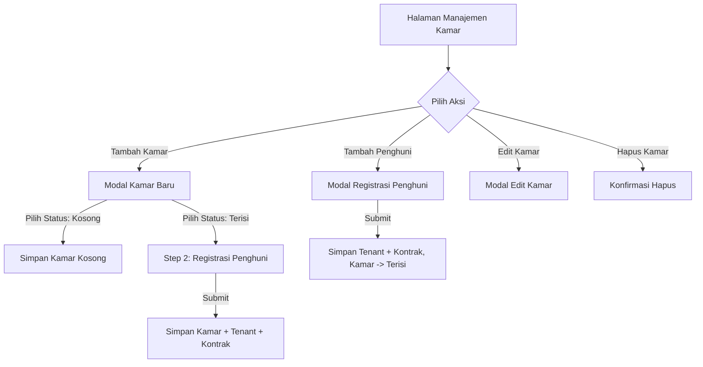

# Product Requirements Document (PRD): Restrukturisasi Lapor Kos

**Status:** Finalized / In Development  
**Target Audience:** AI Agent / Developer  
**Version:** 2.0 (Updated post User-Tenant Merge implementation)

---

## 1. Context & Problem Statement
Aplikasi "Lapor Kos" saat ini telah di-refactor untuk mengatasi inefisiensi pada tingkat database dan alur kerja (UX/UI):
- **Database:** Redudansi data telah dihilangkan dengan melakukan merger entitas `Tenant` ke dalam tabel `users` (ditandai dengan kolom `ktp_url` dan `selfie_url` di `users`, serta peran/role `"tenant"`). Tabel `tenants` telah dihapus sepenuhnya dari database.
- **UX/Alur Kerja:** Pemilik kos tidak perlu lagi menginput data secara terpisah di tiga halaman berbeda. Alur pendaftaran kamar dan penyewa kini terpusat menjadi alur kerja yang *streamlined*.

---

## 2. Objectives (Tujuan)
- **Single Source of Truth:** Menjadikan tabel `users` sebagai satu-satunya profil data diri baik untuk Owner maupun Tenant.
- **Efisiensi Pendaftaran:** Memungkinkan proses pendaftaran kamar terisi (Occupied Room) dan penambahan penghuni (Assign Tenant) dilakukan secara instan melalui modal terintegrasi.
- **Keamanan Data & Relasi:** Memastikan integritas referensi asing (Foreign Key) yang sebelumnya mengarah ke `tenants` kini mengarah langsung ke `users.id`.

---

## 3. Alur Fitur & Fungsi Utama (UX/UI Flows)

### 3.1. Alur Manajemen Kamar (Rooms Page)
Halaman ini adalah pusat manajemen kamar bagi Owner (`/dashboard/rooms`).

#### A. Alur Tambah Kamar Baru & Penghuni (Wizard 2 Langkah)
1. **Langkah 1 (Kamar):** Owner mengisi Nomor Kamar, Harga/Bulan, Deskripsi/Fasilitas, dan memilih Status `"occupied"` (Terisi).
2. **Langkah 2 (Penghuni & Kontrak):** Owner otomatis diarahkan ke formulir Registrasi Penghuni untuk mengisi Nama Lengkap, Nomor HP/WA, Email, Tanggal Masuk, Durasi Sewa (bulan), serta mengunggah Dokumen KTP dan Foto Selfie.
3. **Penyimpanan:** Data kamar, data diri user (tenant), dan data kontrak dikirim bersamaan via `POST /api/rooms/with-tenant`.
4. **Hasil:** Kamar berstatus `"occupied"` langsung terbuat, User baru ber-role `"tenant"` ditambahkan, dan `Contract` berstatus `"active"` dibuat dalam satu transaksi database (`pgx.Tx`).

#### B. Alur Penambahan Penghuni ke Kamar Terdaftar (Assign Tenant)
1. Owner memilih kamar yang berstatus kosong (`"available"`), lalu mengklik tombol **"Tambah Penghuni"**.
2. Owner mengisi data diri penyewa (Nama, Email, HP/WA, Tanggal Masuk, Durasi Sewa) beserta unggahan file KTP dan Selfie.
3. **Penyimpanan:** Data dikirim via `POST /api/rooms/:id/assign-tenant`.
4. **Hasil:** Kamar terdaftar diperbarui statusnya menjadi `"occupied"`, User penyewa baru dibuat/diperbarui, dan kontrak sewa aktif dibuat.

---

### 3.2. Alur Direktori Penghuni (Tenants Page) & Detail Profil Penyewa
Halaman ini (`/dashboard/tenants`) berfungsi sebagai direktori utama untuk melihat dan memelihara data penyewa aktif.
- **Pencarian & Filter:** Owner dapat mencari berdasarkan nama atau nomor kamar, serta memfilter status sewa/pembayaran.
- **Detail Profil (`/dashboard/tenants/[id]`):** Tombol "Detail Profil" mengarahkan Owner langsung ke halaman Detail Profil Penyewa. Di halaman ini, Owner dapat melakukan:
  1. **Edit Penugasan Kamar:** Memindahkan/mengganti penugasan kamar penyewa ke unit kamar kosong ("available") lainnya.
  2. **Edit Dokumen Identitas:** Mengunggah berkas KTP baru (`ktp_url`) dan Foto Selfie baru (`selfie_url`).
  3. **Edit Data Pribadi:** Memperbarui Nama Lengkap dan Nomor HP/WA (Email bersifat unik untuk autentikasi dan tidak dapat diubah oleh Owner demi menjaga konsistensi login).
  4. **Edit Informasi Sewa:** Memperbarui Tanggal Masuk (Mulai Sewa) dan Durasi Kontrak (bulan).
  5. **Melihat Dokumen:** Membuka berkas dokumen KTP dan Selfie yang telah terupload dalam tab baru.
  6. **Melihat Ringkasan Finansial:** Menampilkan total pembayaran, status pembayaran, dan sisa durasi kontrak sewa.
  7. **Hapus Penyewa (Checkout):** Menghapus penyewa secara permanen dari sistem, yang otomatis membatalkan kontrak sewa aktif dan mengosongkan status kamar terkait menjadi `"available"` kembali.

---

### 3.3. Alur Portal Penghuni (Tenant Portal Dashboard)
Ketika penyewa (role `"tenant"`) masuk, mereka diarahkan ke halaman muka khusus (`/dashboard` mode tenant).
- **Informasi Kontrak:** Menampilkan status sewa aktif, tanggal mulai/berakhir sewa, harga sewa per bulan, dan progress sisa hari sewa secara visual.
- **Informasi Tagihan:** Menampilkan tagihan aktif untuk bulan berjalan yang belum lunas.
- **Rekening Pembayaran:** Menampilkan nomor rekening pemilik kos dan tombol salin.
- **Form Komplain:** Tautan langsung ke modul komplain untuk melaporkan kerusakan fasilitas.

---

## 4. Batasan & Aturan Operasi CRUD (CRUD Matrix & Constraints)

Untuk menjaga integritas data dan konsistensi status sewa, beberapa batasan ketat diterapkan pada operasi CRUD:

| Entitas | Operasi | Deskripsi / Alur Kerja | Batasan & Aturan Validasi |
| :--- | :--- | :--- | :--- |
| **Kamar** | **Tambah (Create)** | Menambahkan unit kamar baru. | - Nomor kamar harus unik. - Jika status `"occupied"`, formulir registrasi penghuni wajib diisi lengkap. |
| | **Lihat (Read)** | Menampilkan detail kamar, status, fasilitas, dan penyewa aktif jika terisi. | - Dapat dilihat oleh Owner. - Tenant hanya dapat melihat kamar yang disewanya via dashboard profile. |
| | **Ubah (Update)** | Memperbarui nomor kamar, harga, atau deskripsi/fasilitas. | - **Status kamar tidak dapat diubah secara manual** menjadi `"available"` jika masih terikat kontrak aktif. - Status otomatis berubah menjadi `"occupied"` jika ada kontrak aktif baru. |
| | **Hapus (Delete)**| Menghapus unit kamar dari sistem. | - Menghapus kamar yang memiliki kontrak aktif akan menghapus kontrak, transaksi pembayaran, dan laporan keluhan terkait (`CASCADE`). |
| **Penyewa (User)** | **Tambah (Create)** | Dibuat secara otomatis saat proses tambah kamar terisi atau assign tenant. | - Tidak ada menu pembuatan penyewa mandiri oleh Owner. - Email wajib diisi dan harus unik di database. - Password bawaan diset menggunakan nomor HP penyewa secara default. |
| | **Lihat (Read)** | Menampilkan data diri, foto KTP, selfie, nomor telepon, dan email. | - Hanya dapat diakses oleh Owner dan penyewa bersangkutan. - Dapat diakses via Direktori Penghuni ke halaman Detail Profil Penyewa (`/dashboard/tenants/[id]`) atau Detail Kontrak (`/dashboard/contracts/[id]`). |
| | **Ubah (Update)** | Memperbarui nama, nomor HP, penugasan kamar, tanggal masuk, durasi kontrak, KTP, dan selfie. | - Penyewa dapat mengubah profil dan password mereka sendiri via halaman pengaturan. - Owner dapat memperbarui nama, nomor HP, tanggal masuk, durasi kontrak, serta mengunggah dokumen KTP & Selfie baru dan memindahkan kamar melalui halaman Detail Profil Penyewa (`/dashboard/tenants/[id]`). - *Email penyewa tidak dapat diubah oleh Owner demi menjaga keamanan dan konsistensi akun autentikasi.* |
| | **Hapus (Delete)**| Menghapus data penyewa dari database secara permanen (Checkout). | - Owner dapat menghapus penyewa secara permanen dari halaman Detail Profil Penyewa (`/dashboard/tenants/[id]`). - Penghapusan ini otomatis membatalkan kontrak sewa aktif, menghapus tagihan/komplain terkait, dan mengosongkan kembali status kamar terkait menjadi `"available"`. |
| **Kontrak** | **Tambah (Create)** | Mengikat hubungan sewa antara Kamar dan User. | - Hanya dapat dibuat melalui penambahan kamar terisi atau penambahan penghuni (Assign Tenant). |
| | **Lihat (Read)** | Menampilkan detail tanggal kontrak, harga sewa, durasi sewa, sisa hari, dan data penyewa. | - Menjadi halaman detail utama untuk informasi finansial dan durasi kontrak (`/dashboard/contracts/[id]`). |
| | **Ubah (Update)** | Mengubah durasi sewa, tanggal mulai/akhir, harga sewa, dan status kontrak. | - Status kontrak dapat diubah menjadi `"expired"` atau `"cancelled"`. Jika diubah, status kamar yang bersangkutan otomatis kembali menjadi `"available"`. |
| | **Hapus (Delete)**| Menghapus kontrak sewa dari database. | - Menghapus kontrak akan secara otomatis mengubah status kamar terkait menjadi `"available"` (Kosong). |

---

## 5. Technical Requirements & API Definitions

### 5.1. Database Schema Status
- **Tabel `users`:** Menjadi *Single Source of Truth* untuk Owner dan Tenant. Kolom tambahan: `phone` (VARCHAR), `ktp_url` (TEXT), dan `selfie_url` (TEXT).
- **Tabel `contracts`:** Kolom `tenant_id` telah diubah menjadi `user_id` yang mereferensikan `users(id)` dengan relasi `ON DELETE SET NULL`.
- **Tabel `complaints` & `payments`:** Kolom `tenant_id` diubah menjadi `user_id` (atau diakses via kontrak).

### 5.2. API Endpoints
Aplikasi didukung oleh endpoint berikut:

1. **`POST /api/rooms/with-tenant`**
   - **Tujuan:** Membuat kamar baru sekaligus mendaftarkan penyewa dan membuat kontrak aktif dalam satu transaksi database.
   - **Payload:** Multipart form berisi info kamar, data diri penyewa, tanggal masuk, durasi, file KTP, dan Selfie.
2. **`POST /api/rooms/:id/assign-tenant`**
   - **Tujuan:** Menambahkan penyewa baru ke kamar yang sudah terdaftar.
   - **Payload:** Multipart form berisi data diri penyewa, tanggal masuk, durasi, file KTP, dan Selfie.
3. **`GET /api/tenants/me`**
   - **Tujuan:** Mengembalikan data profil tenant yang sedang login beserta informasi kamar dan kontrak aktifnya untuk merender Dashboard Tenant.
4. **`GET /api/contracts`**
   - **Tujuan:** Mengambil seluruh daftar kontrak sewa untuk di-render di halaman Direktori Penghuni.
